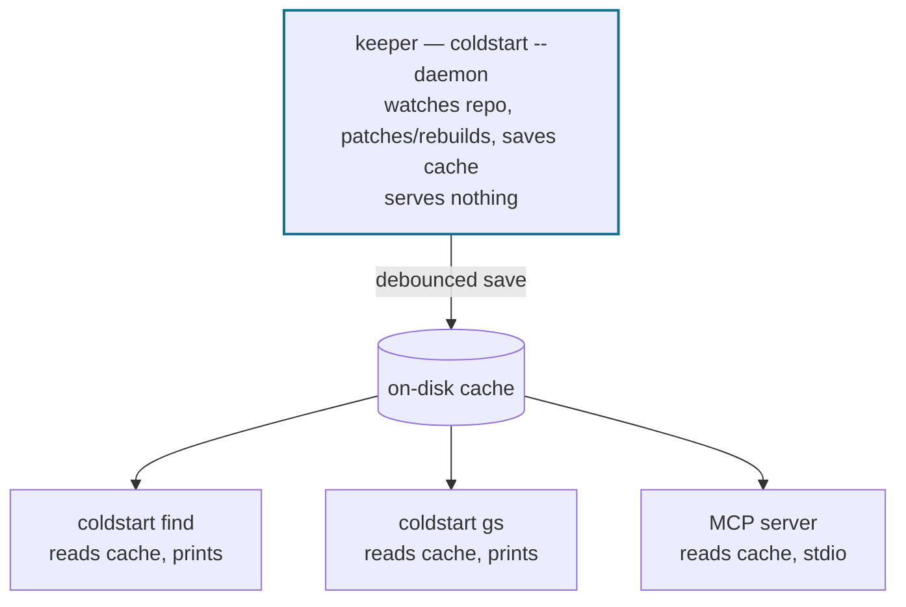

<div align="center">


<h1>coldstart</h1>

<p>
  <b>Self-maintaining codebase knowledge for AI coding agents.</b><br/>
  Agent-written notes that stay anchored to your code — plus fast, deterministic navigation — so Claude Code, Codex, and Cursor stop rediscovering the repo every session.
</p>

<p>
  <a href="https://www.npmjs.com/package/@cstart/coldstart"></a>
  
  <a href="#license"></a>
  
</p>

<p>
  <a href="https://akashgoenka.github.io/coldstart/"><b>Website</b></a> &nbsp;·&nbsp;
  <a href="https://akashgoenka.github.io/coldstart/docs.html"><b>Docs</b></a> &nbsp;·&nbsp;
  <a href="./PHILOSOPHY.md"><b>Philosophy</b></a> &nbsp;·&nbsp;
  <a href="https://www.npmjs.com/package/@cstart/coldstart"><b>npm</b></a>
</p>

</div>

Two layers, one tool:

- **The notebook** (`coldstart kb`) — durable, agent-written notes about how _this_ codebase actually works: what a file is for, how a flow spans files, which invariants hold. Captured after real tasks, recalled when a later task matches, and kept honest by the index — every note is anchored to real files, and a note whose evidence drifted is flagged, not served as truth.
- **Navigation** (`coldstart find` / `coldstart gs`) — a fast static index over file paths, symbol names, exports, and the import/call graph. It answers "which files are relevant to this task?" in milliseconds, with checkable evidence instead of a similarity score.

No embeddings, no model to run, no service to babysit. Agents are already good at reading and reasoning about code; what they waste tokens on is _finding_ the right file and _re-deriving_ what the last session already figured out. coldstart does those two parts and gets out of the way.

---

## Install

Requires Node.js 18+.

```bash
npm install -g @cstart/coldstart
cd your-project
coldstart init   # coldstart.md + client wiring + notebook + background index warm-up
```

A single `coldstart init` does everything — navigation **and** the notebook. It asks two things — the **experience** (`cli`, recommended, or `mcp`) and the **client** — then writes the agent-facing guidance into the client's own rules file (as an imported `coldstart.md` for Claude Code; inlined directly for Cursor and Codex, which don't resolve `@file` references), wires the client, and sets up the notebook (skeleton, git wiring, and — for Claude Code, Codex, and Cursor — the capture/recall hooks). Pass `--experience` / `--client` to skip the prompts. The client is never auto-detected; you always pick it.

- **Claude Code** → writes `coldstart.md` and ensures `CLAUDE.md` imports it via `@coldstart.md`, and registers both the find/gs search hooks (a PostToolUse nudge + a PreToolUse find-dedup guard) and the notebook recall/capture hooks (UserPromptSubmit + Stop/SubagentStop) in `.claude/settings.json` — merged into any existing settings, never overwriting them. The `mcp` experience also writes `.mcp.json`.
- **Codex** → embeds the full coldstart guidance inline in a marked block in `AGENTS.md` (Codex has no `@file` include, so there's no separate `coldstart.md`), refreshed in place on re-run, and registers Codex-specific navigation plus notebook hooks in `.codex/hooks.json`. The capture hook understands Codex rollout and subagent transcripts. The `mcp` experience also writes `[mcp_servers.coldstart]` into `.codex/config.toml`.
- **Cursor** → writes `.cursor/rules/coldstart.mdc` — an always-applied rule that carries the full coldstart guidance inline (Cursor doesn't reliably resolve `@file` references in rules), rewritten on every init — and registers Cursor-specific navigation plus notebook hooks in `.cursor/hooks.json` (a `preToolUse` find-dedup guard, a `postToolUse` nudge, `beforeSubmitPrompt` recall, and `stop`/`subagentStop` capture — merged into any existing hooks). The capture hook parses Cursor's own conversation transcript. The `mcp` experience also writes `.cursor/mcp.json`.
- **Other** → writes `coldstart.md` only, and prints the wiring directions (plus the MCP server entry for the `mcp` experience).

`init` then warms the index in the background, so your first lookup is instant. Re-running `init` is safe — it never duplicates entries.

### Upgrading

```bash
npm install -g @cstart/coldstart@latest
coldstart init   # re-run in each project to refresh coldstart.md
```

A version stamp in the keeper's lockfile makes the old background keeper shut down on the next lookup; a fresh one spawns from the new binary. No manual restart needed.

> [!NOTE]
> **Migrating from `coldstart-mcp`:** the package was renamed `coldstart-mcp` → **`@cstart/coldstart`** at 2.0.0 (the CLI is now the primary surface). `coldstart-mcp` is deprecated but still installs; switch with `npm uninstall -g coldstart-mcp && npm install -g @cstart/coldstart && coldstart init`. The `coldstart-mcp` binary name is kept as an alias, so existing MCP configs keep working.

### Removing coldstart

`init` writes per-repo wiring that a global `npm uninstall` can't reach (npm fires no reliable uninstall hook, and it has no record of which repos you `init`'d). So — like husky — coldstart ships an explicit reverse:

```bash
coldstart unwire          # strip coldstart's wiring from this repo (notebook kept)
coldstart unwire --purge  # also delete .coldstart/notebook/ and its git plumbing
```

`unwire` removes **only** coldstart-owned markers from the files `init` touched — hook entries, the `@coldstart.md` import, the `AGENTS.md` block, the MCP server entry, and files coldstart fully owns (`coldstart.md`, `.cursor/rules/coldstart.mdc`) — never your own content in shared files. It sweeps all four clients, is idempotent (a second run reports everything already gone), and **keeps the notebook by default** since it's committed, shared data. Run it in each project first, then `npm uninstall -g @cstart/coldstart` to remove the package.

---

## The notebook

A repo-local knowledge base written and read by agents, in `.coldstart/notebook/`:

```bash
coldstart kb search tile save lifecycle   # plain task words, symbols, or file names
coldstart kb lookup src/models.py Tile    # everything known at one exact address
coldstart kb write spec.json              # the write gate (two-phase dedup)
coldstart kb commit                       # publish notes to git, nothing else rides along
coldstart kb view                         # open a single-file HTML browser of the notebook
coldstart kb status / lint / render / init / migrate
```

**What a note is.** Three shapes: a **file note** (what a file is for — a single summary, or per-symbol facets for hub files), a **flow note** (a cross-file story: ordered steps, invariants), and a **lesson** (a trap, rule, bug-cause, rationale, or confirmed absence). Every note carries **anchors** — concrete file paths and symbols its claims rest on.

**Where notes reach the agent.** Three surfaces, no new habits required:

1. **`Summary:` lines on `find` results** — a past agent's verified overview of a file, right where the file ranks. `[fresh]` means the file is byte-identical to when the summary was verified — the agent can rely on it without re-reading the file.
2. **Recall at prompt time** (optional hook) — notes whose titles, aliases, or anchors match the incoming prompt are surfaced as a compact title + gist + path block, hard-capped, framed as reference data. Nothing matches → nothing injected.
3. **`kb search` / `kb lookup`** — a search engine over the notebook for mid-task vocabulary changes, and an exact-address lookup (`path [symbol]`) before editing a file.

**Why it can be trusted.** This is the part that took the design work:

- **Freshness is mechanical, not hoped-for.** Every anchor is stamped with a content hash at write time; the index re-checks stamps as the code changes. A drifted note renders `[evidence changed: <path>]` and the guidance says re-verify — stale knowledge degrades into a labeled hypothesis instead of a confident lie.
- **The log is the truth.** Notes live in an append-only `.raw` event log (commit it — merges are unions, so parallel branches of notes reconcile without conflicts). The Markdown notes are derived, regenerated mechanically, and gitignored.
- **Writes go through a gate.** A new note's concept is first searched against existing notes — the agent must explicitly merge into a match (`--into <id>`) or declare it new (`--new`). Duplicates are gated at write time, not cleaned up later.
- **Concurrent sessions are safe.** Multiple agents can write at once: per-note append-only logs, exclusive creation for new note ids (a same-moment duplicate becomes two visible notes, never a silent merge), lossless merging for shared file notes, and atomic renders (a reader never sees a half-written note).
- **Corrections happen in-session.** If an agent finds a note wrong while the evidence is in its context, the guidance tells it to fix or retract the note right then — no better-placed future agent exists.

**Setup:** the notebook comes with `coldstart init` — no separate step. It creates the notebook skeleton, sets union-merge for the logs, and (on Claude Code, Codex and Cursor) wires the two hooks — capture at session end, recall at prompt time. (`coldstart kb init` still exists as an alias if you want to (re-)wire just the notebook.) Other hosts can drive the notebook without the hooks: via the full `kb` CLI, or — for no-shell clients — the `kb_search` / `kb_lookup` / `kb_write` / `kb_status` MCP tools.

**Language-agnostic.** The notebook's freshness machinery is content-hash based, so it works on any codebase — including languages the navigation index doesn't parse. Where the index does parse, notes additionally get symbol-level freshness.

> [!NOTE]
> **The notebook is young.** What's verified today: notes written by agents in real sessions checked out accurate against the code; the stale-note loop closes end-to-end (flag → re-read → correction); capture, recall, and concurrent writes hold up under stress. The bet — stated as a bet — is that a corpus like this compounds over a repo's lifetime: the second time any question comes up, the answer is one `Read` away instead of a re-derivation.

---

## Navigation: the two operations

|                    | What it answers                                                                                                                                                            | Replaces                                               |
| ------------------ | -------------------------------------------------------------------------------------------------------------------------------------------------------------------------- | ------------------------------------------------------ |
| **`find <terms>`** | "Which files are about this?" — ranks files by how many of your query terms they cover (filenames, path segments, exported symbols, plus a repo-wide name-reference pass). | a flurry of `grep`/`glob` while orienting              |
| **`gs <file>`**    | "What is this file?" — top-level symbols with line ranges, who imports it, who calls each symbol, and name-related neighbors.                                              | reading a whole file just to learn its shape and usage |

The intended flow: **`find`** a concept → pick the best path → **`gs`** that file for its shape and who uses it → `Read` only for the implementation inside a method body. Notebook summaries ride along on `find` results, so often the orientation step answers itself.


### `find` — locate the files for a concept

```bash
coldstart find auth session cookie
```

> [!TIP]
> **Pass every salient identifier** from your task — the symbol, the domain noun, the rare token you half-remember — not one distilled keyword. `find` ranks files by how many of your terms each one covers and shows, per file, which terms it defines vs. imports and a preview of the lines where they cluster. Often that's enough to answer without opening anything.

Speed-wise, `find` competes with raw grep: its repo-wide reference pass runs on **ripgrep** — yours from PATH, the bundled copy, or an editor's (`COLDSTART_RG` overrides) — with `git grep`/`grep` fallbacks, and the ranked page comes from the pre-built index, not a scan.

**Flags:** `--path GLOB` (scope; comma-combine, `!` excludes) · `--tests` (include test files) · `--via` (show name-reference relations) · `--json`

### `gs` — drill into one file

```bash
coldstart gs src/auth/service.ts
```

Returns the file's symbols (with line ranges), its 1-hop internal imports, who imports it, and per-symbol cross-file callers — in one call. This is the answer to **"who uses this file / who calls this symbol"**; it is not a grep.

**Flags:** `--symbol a,b` (deliver named method bodies inline) · `--match TERM` (filter a god-file to one area; `a|b` = OR, `/regex/` = regex) · `--view symbols|imports|importers|callers` · `--json`

### Batch independent lookups in one shell call

```bash
coldstart find auth; coldstart find 'session cookie'; coldstart gs src/auth/service.ts
```

---

## Two ways to call it, identical output

coldstart ships as one binary with two front doors:

- **CLI (primary)** — `coldstart find …` / `coldstart gs …` / `coldstart kb …`. For any shell-capable agent (Claude Code, Cursor, terminal use). This is the fast path.
- **MCP (for no-shell clients)** — the `find` and `gs` tools, plus the notebook as `kb_search` / `kb_lookup` / `kb_write` / `kb_status`, all byte-identical to the CLI. For clients like Claude Desktop that have no shell. (`kb commit` stays CLI/human-only — publishing notes to git is never an agent action.)

Same engine, same index, same results. Pick whichever your agent can reach.

It works best with **Claude Code**, **Codex**, and **Cursor**: all three get platform-specific find/gs hooks and notebook recall/capture hooks from `coldstart init`. Any other client gets `coldstart.md` plus printed wiring directions.

---

## Bring your own semantics

coldstart has no embeddings, no generated summaries, no semantic layer computed at index time — **on purpose. The semantic layer is the agent.** Every consumer is already a frontier model; pre-computing meaning at index time only duplicates that, worse and stale. So the index keeps what's cheap to keep _exact_ — paths, symbols, exports, the import/call graph — and returns _why_ each file ranked.

The notebook is the same philosophy applied to memory: coldstart still computes no meaning of its own. It stores, anchors, and freshness-checks the meaning **agents** author — written at task time, by the reasoner that had the full context, about the question that actually mattered. The full argument is in **[PHILOSOPHY.md](./PHILOSOPHY.md)**.

---

## How the index stays fresh

coldstart is **one keeper, thin readers**:



- A single **keeper** process per repo watches the filesystem and keeps the on-disk cache current. It does **not** answer queries.
- The CLI readers (`find`/`gs`) and the MCP server are **stateless readers** over that cache. The first reader for a repo lazily spawns the keeper, so even uncommitted edits stay live.
- **Readers never build the index.** On a cache miss they wait for the keeper's build (progress to stderr) instead of silently kicking off a multi-minute build inline — or three of them concurrently.
- No HTTP, no ports, no bridge. The keeper logs to `~/.coldstart/daemon/<root>.log` and exits when its lockfile is removed.

**There is no cache TTL.** The index is never discarded for being old — it's kept _correct_ instead:

- **While the keeper runs:** edits are debounced (400 ms), then **patched incrementally** (~2–5 ms/file, up to 30 files or 20% of the repo, whichever is larger) or trigger a **background full rebuild** above that (served from the last good index until the swap). The cache re-saves ~5 s after edits settle, in **atomic generations** — a reader can never load a half-written mix of old and new.
- **When the keeper starts:** it **reconciles** — stat-checks every indexed file against its stored fingerprint (~150 ms even at 16k files) plus a git diff against the indexed HEAD — and patches exactly what changed while nothing was watching. A branch switch that used to force a 96-second rebuild on a 16k-file repo is now a ~3-second patch.
- **As a backstop:** every patch is lint-checked against index invariants (a violation triggers an automatic rebuild and lands in a repair log that `status` shows), and a rotating fingerprint audit after each save catches watcher-missed events.

The keeper also stamps the notebook's anchor freshness (a small sidecar, derived single-flight) — the notebook never loads the code index to answer a query.

### Lifecycle commands

```bash
coldstart status              # keepers on this machine: alive? fresh? last patch/rebuild/save? repairs?
coldstart restart             # kill the current repo's keeper (respawns on next lookup)
coldstart restart --root DIR  # kill a specific repo's keeper from anywhere
coldstart restart --all       # kill every keeper
coldstart index               # build + save the cache once, up front (single-writer prep)
```

`restart` is the right move whenever anything feels stale — a fresh keeper reconciles on start, so it comes back _correct_, not just alive. `status` answers "is my index fresh, and why?": liveness, cache age, the keeper's last reconcile/patch/rebuild/save stamps, and the tail of the repair log — no network probe.

---

## Supported languages

Navigation index: TypeScript, JavaScript, JSX/TSX, Vue, Svelte, Astro, AngularJS 1.x, Java, Kotlin, Ruby (Rails-aware: `has_many`/`belongs_to` associations, `routes.rb` resources, controller↔view edges), Python (Django convention edges), Go, Rust, C#, PHP (Laravel convention edges), C++, Groovy (incl. Gradle DSL), GraphQL, YAML, TOML, XML, and `.env` files.

**Not indexed:** Swift, Dart — no extension mapping; these files are not walked or parsed.

The **notebook works regardless** — its freshness stamps are content-hash based, so notes on a Swift repo are as trustworthy as notes on a TypeScript one (they just lack symbol-level freshness detail).

---

## When _not_ to reach for it

- A literal string / phrase / regex inside file bodies → **Grep**.
- Reading an implementation → **Read**, after `gs` gives you the shape.
- `find` says _"no indexed file contains any of […]"_ → those identifiers aren't in the repo. Don't grep spelling variants.

---

## Development

```bash
npm install
npm run build
npm test

# run a query from your build:
node dist/index.js find auth --root .

# run the MCP server in a single process (no background keeper) for debugging:
node dist/index.js --root . --no-daemon
```

See [PHILOSOPHY.md](./PHILOSOPHY.md) for why coldstart computes no semantics of its own, [ARCHITECTURE.md](./ARCHITECTURE.md) for the index pipeline, process model, and notebook internals, and [TROUBLESHOOTING.md](./TROUBLESHOOTING.md) for recovery procedures.

---

## Limitations

1. It's a routing layer plus an agent-written notebook — no semantic analysis or generated code summaries. This is deliberate: the consuming agent is the semantic layer (see [PHILOSOPHY.md](./PHILOSOPHY.md)).
2. `gs` callers are one-hop and file-scoped. Member-expression calls (`this.method()`, `api.method()`) aren't cross-file resolved; named function/constant calls are. Chase further hops by calling `gs` on the caller files.
3. Dynamic/computed imports (`import(variable)`) and runtime-DSL references (polymorphic associations, gem/reflection-backed models) stay unresolved.
4. Hidden directories and files over 1 MB are skipped by the index.
5. The keeper is per-repo and per-machine — no sharing across projects or hosts. The notebook _does_ travel: its `.raw` logs are committed and union-merge across branches and machines.
6. Notebook quality is bounded by what writing agents actually read — notes are accurate about what they state, but a note is not a proof of completeness.

## License

MIT — see [LICENSE](./LICENSE).

---

[](https://glama.ai/mcp/servers/AkashGoenka/coldstart)
